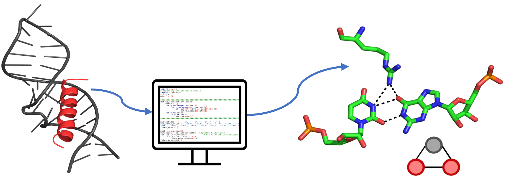

# Spanning Motif Identifier for RNA–Protein Complexes

A Python-based tool to identify and classify **spanning motifs** in RNA–protein complexes using hydrogen bond data and corresponding PDB structures.

<!--- BADGES: START --->
[](https://www.python.org/downloads/release/python-360/)
<!--- BADGES: END --->

## Overview

Spanning triplets comprise a single amino acid hydrogen bonded with two ribonucleotides (not mutually involved in a Watson–Crick base pair), or vice versa. With their high specificity, these motifs can aid in a better understanding of RNA–protein recognition and associated phenomena. To achieve this, we developed a Python algorithm that provides a topology-based classification and nomenclature scheme to automatically identify spanning triplet motifs in the crystal structures of RNA–protein complexes. This technique can also be extended to include higher-order spanning motifs.

This pipeline processes `.hb2` files (from HBPLUS) along with PDB files to:
- Extract amino acid and nucleotide-centered spanning motifs
- Filter out false motifs
- Classify motifs based on topological features

## Requirements

- Python 3.x
- `.hb2` files generated using [HBPLUS](http://www.ebi.ac.uk/thornton-srv/software/HBPLUS/)
- Corresponding PDB files

## File Structure

Place the following scripts in a single folder along with:
- `.hb2` files
- Corresponding `.pdb` files

### Scripts:

1. `1_aa_motifs_False.py`
2. `2_nt_motifs_False.py`
3. `3_Remove_false_spanning_motifs.py`
4. `4_topologies_amino_acid_centered_spanning_motifs.py`
5. `5_topologies_nucleotide_centered_spanning_motifs.py`

---

## Usage

### Step 1: Generate Motifs

Run the following scripts to extract potential spanning motifs:

```bash
python3 1_aa_motifs_False.py
python3 2_nt_motifs_False.py
